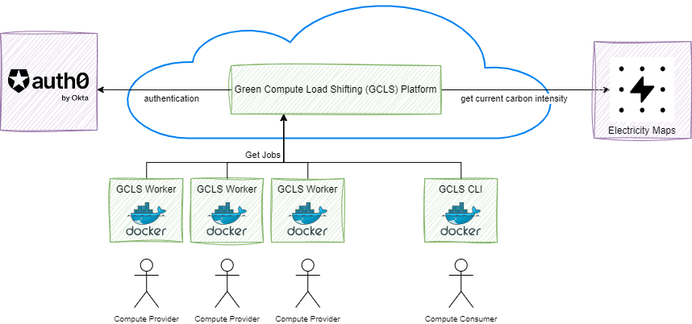
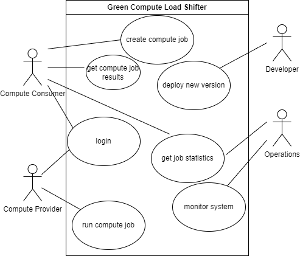
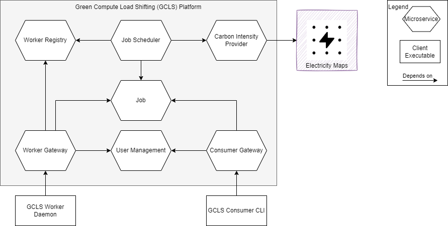

# Green Load Shifting Platform

## Problem
Climate change is one of the biggest challenges in this century. Energy consumption in data centers is a significant contributor (20% of the German electricity consumption in the services sector)^[ *Germany energy report*, December 2022, Enerdata] 

## Goal
Reduce carbon emissions in computing

## Means
Creating a platform that allows to shift compute jobs to regions with a low carbon intensity

# Overview - Diagram

{ height=75% }

<https://app.electricitymaps.com/>    <https://auth0.com/>

# Use Cases
{ height=80% }

# Functional Requirements

1. Consumers can create new computation jobs. A container image along with a set of environment variables defines the computation job. 

2. Consumers can get the results of a compute job. The result consists of the state, the standard output produced by the job, and an estimate of the amount of CO2 equivalent that has been been emitted while executing the job.

3. Providers can offer computing capabilities and run assigned jobs

4. Jobs are scheduled to minimize runtime and carbon footprint

# Quality Requirements - Performance Efficiency

## Time behavior

$95\%$ of all backend requests that originate from a user must be handled in less than $50 ms$

## Capacity

The system must be able to handle up to 10000 jobs per day.

# Quality Requirements - Compatibility

## Interoperability

The system must support Docker container images that are available on [the docker hub](https://hub.docker.com/)

# Quality Requirements - Reliability

## Availability

In each 24h timeframe, the request success rate must be at least $95\%$  

## Fault tolerance

The system must not reject requests in case the carbon intensity provider is temporarily not available.

# Quality Requirements - Security

## Authenticity 

All inter service communication must be authenticated and authorized (Zero Trust)

## Confidentiality 

- Compute Consumers and Compute Providers must ony be able to access job information assigned to them 

# Quality Requirements - Maintainability

## Reusability

Cross cutting concerns shall be implemented consistently in all services

## Testability

- The business code must be testable in isolation
- The unit test coverage of the business code must be at least $80\%$

# Quality Requirements - Flexibility

## Replaceability

- The cloud provider must be replaceable without changing the business code
- The carbon intensity provider must be replaceable without redeploying more than one service

# Boundary Conditions - Architecture

1. The predefined microservices architecture must be followed (see services/entity for an example service)
2. All services/clients must be implemented using the Go Programming Language
3. Each microservice needs to adhere to the [ports & adapters](https://en.wikipedia.org/wiki/Hexagonal_architecture_(software)) structure
4. All services need to be stateless
5. All synchronous communication shall be handled using REST APIs
6. APIs shall be idempotent, breaking changes shall be avoided
7. Each service must be containerized

# Boundary Conditions - Development

1. A single monorepo shall be used for all code
2. All Infrastructure shall be defined as code (IaC) using [terraform](https://www.terraform.io/
3. All features must be implemented in short lived feature branches
4. The usage of 3rd party packages (other than from the Go standard library) must be approved
5. All PRs must be reviewed by at least one other team member before a feature branch can be merged to main
6. All tests must be passed before a feature branch can be merged to main

# Boundary Conditions - Security

1. JWTs shall be used for all requests originating from a client
2. basic auth or mutual TLS shall be used for all other communication
3. secrets must not be stored in the repository

# Boundary Conditions - Deployment

1. All services shall be deployed to a CaaS or PaaS offering in a single Azure subscription
2. Each service has its own CI/CD pipeline
3. Deployments are done independently for each service with zero downtime (Rolling updates)

# Boundary Conditions - Operations

1. All logs shall be written to standard output 
2. Business, Application, and Infrastructure level metrics shall be collected by [prometheus](https://prometheus.io/).
3. All requests shall be traced using [jaeger](https://www.jaegertracing.io/)
4. each service must provide health probes for readiness and liveness
5. each service must terminate upon receiving the SIGTERM signal within 2 seconds.

# Architecture - Building Blocks

{ height=80% }

# Architecture - Building Blocks

| Building Block | Type | Purpose |
| ------ | --- | -------------- |
| GCLS Worker Daemon | Daemon | Provide computing capacity to platform; Execution of jobs |
| Worker Gateway | Microservice | Provides unified API for the GCLS Worker Daemon |
| Worker Registry | Microservice | Holds Status of Worker Daemons |
| GCLS Consumer CLI | CLI | Place compute jobs; Receive Job Status/Results |
| Consumer Gateway | Microservice | Provides unified API for the GCLS Consumer CLI |
| Job | Microservice | Manages the status of Jobs |
| User Management | Microservice |  Manages Users |
| Job Scheduler | Microservice | Identifies a worker for newly created jobs thereby minimizing the carbon footprint |
| Carbon Intensity Provider | Microservice | Provides Carbon Intensity |
